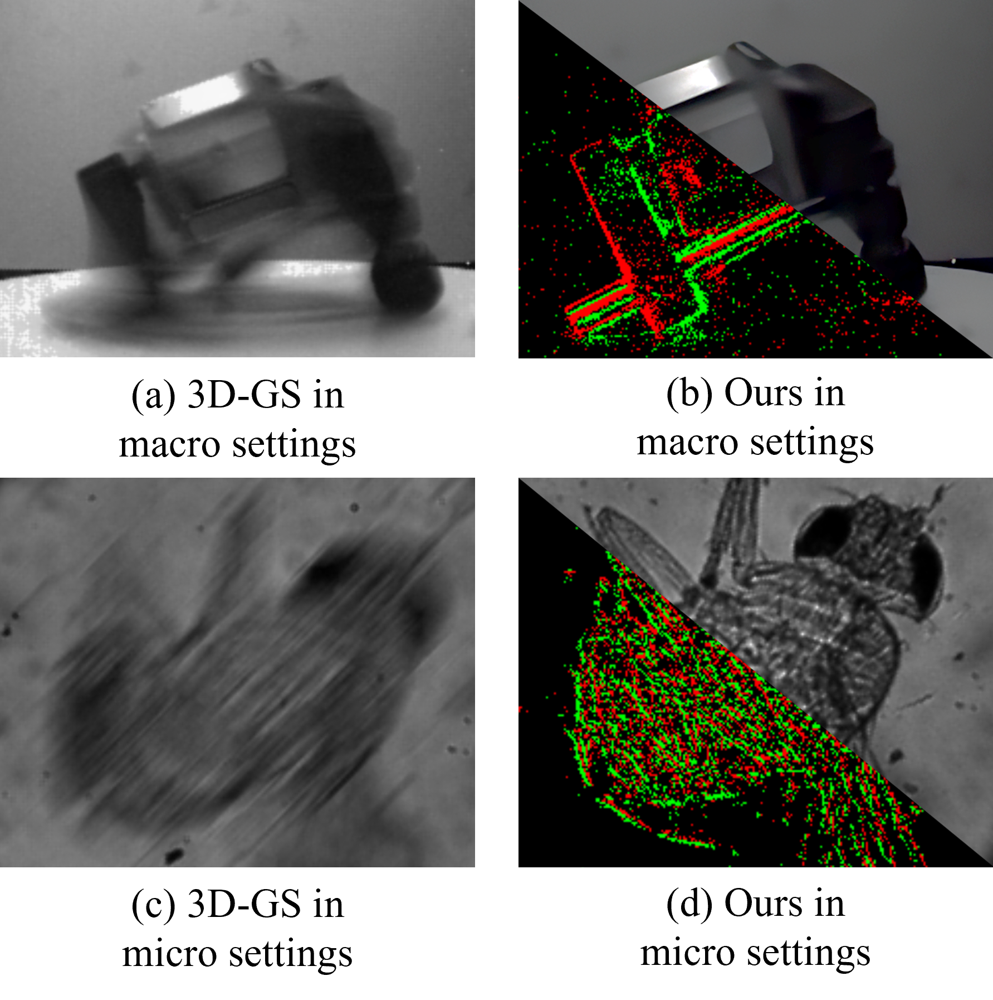
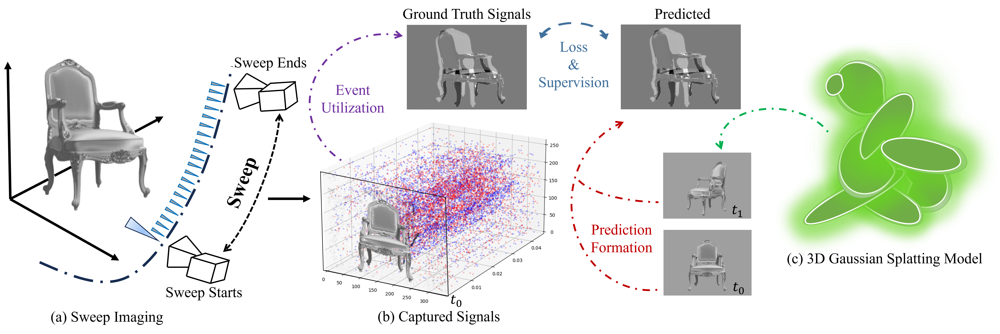

# Official Repository for "SweepEvGS: Event-Based 3D Gaussian Splatting for Macro and Micro Radiance Field Rendering from a Single Sweep"

<p align="center">
  
</p>

> **SweepEvGS: Event-Based 3D Gaussian Splatting for Macro and Micro Radiance Field Rendering from a Single Sweep**  
> Jingqian Wu, Shuo Zhu, Chutian Wang, Boxin Shi, and Edmund Y. Lam  
> *Accepted by IEEE Transactions on Circuits and Systems for Video Technology (TCSVT), 2025*  
> [[Paper on IEEE Xplore]](https://ieeexplore.ieee.org/document/11053840)

---


## 🧠 Overview

**SweepEvGS** is the first framework to reconstruct a complete 3D Gaussian Splatting (GS) radiance field from only a *single camera sweep*, combining a conventional frame and its accompanying event stream.  
It enables **robust macro- and micro-scale 3D radiance field rendering** with low latency and high fidelity.

Key features:
- **Single-Sweep Capture**: one blurry frame + dense event stream → full 3D GS representation  
- **Macro & Micro Unified Pipeline**: works seamlessly for large-scale and microscopic scenes  
- **Efficient Radiance Field Training**: fast convergence and lightweight storage  
- **Hardware-Integrated Setup**: compatible with event cameras and standard microscopes  

<p align="center">
  
</p>

---

## 📦 Repository Contents

This repository currently contains:

```text
Code/
├── point_cloud.ply   # Trained 3D-GS radiance field point cloud for reproducibility
├── Data/             # Example data: one blurry frame + corresponding event stream
└── README            # Description of the uploaded files```

The provided `point_cloud.ply` is a **trained 3D Gaussian Splatting checkpoint** from our paper, and the `Data` folder includes **sample input data** used for the reconstruction.  
These resources allow you to reproduce the visualized results shown in the paper.

---

## 🚀 Coming Soon

We are in the process of organizing the **full training and evaluation code** for public release.  
The following modules will be made available soon:

- 🔧 Data Loader for event and frame streams  
- 🧩 Gaussian Splatting training and optimization pipeline  
- 🌈 Macro/Micro scene configuration and calibration scripts  
- 🧮 Evaluation tools for PSNR/SSIM/LPIPS  
- 📸 Visualization and rendering utilities  

> **Full code coming soon!**  
> Stay tuned for the next update with the complete implementation and training instructions.

---

## 📄 Citation

If you find this repository useful, please consider giving a star ⭐ and citing our paper 🦋:

```bibtex
@article{wu2025sweepevgs,
  title={SweepEvGS: Event-Based 3D Gaussian Splatting for Macro and Micro Radiance Field Rendering from a Single Sweep},
  author={Wu, Jingqian and Zhu, Shuo and Wang, Chutian and Shi, Boxin and Lam, Edmund Y},
  journal={IEEE Transactions on Circuits and Systems for Video Technology},
  year={2025},
  publisher={IEEE}
}

@inproceedings{wu2024ev,
  title={Ev-gs: Event-based gaussian splatting for efficient and accurate radiance field rendering},
  author={Wu, Jingqian and Zhu, Shuo and Wang, Chutian and Lam, Edmund Y},
  booktitle={2024 IEEE 34th International Workshop on Machine Learning for Signal Processing (MLSP)},
  pages={1--6},
  year={2024},
  organization={IEEE}
}
